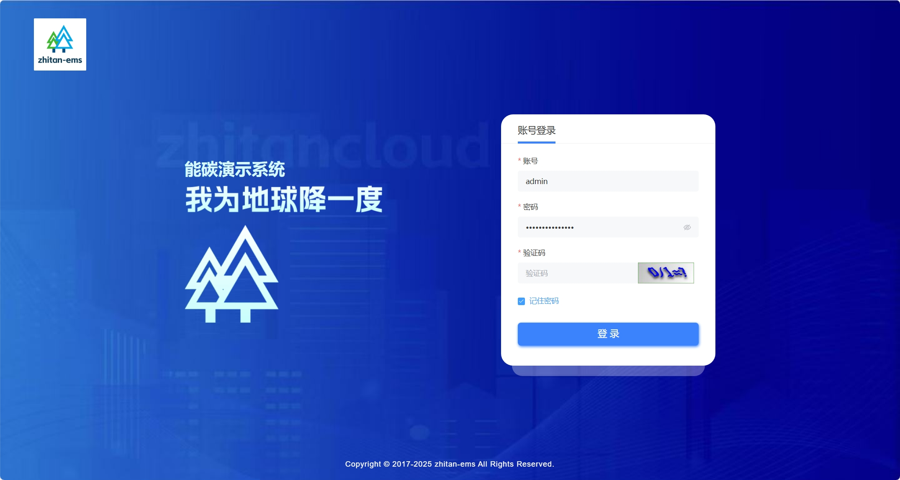
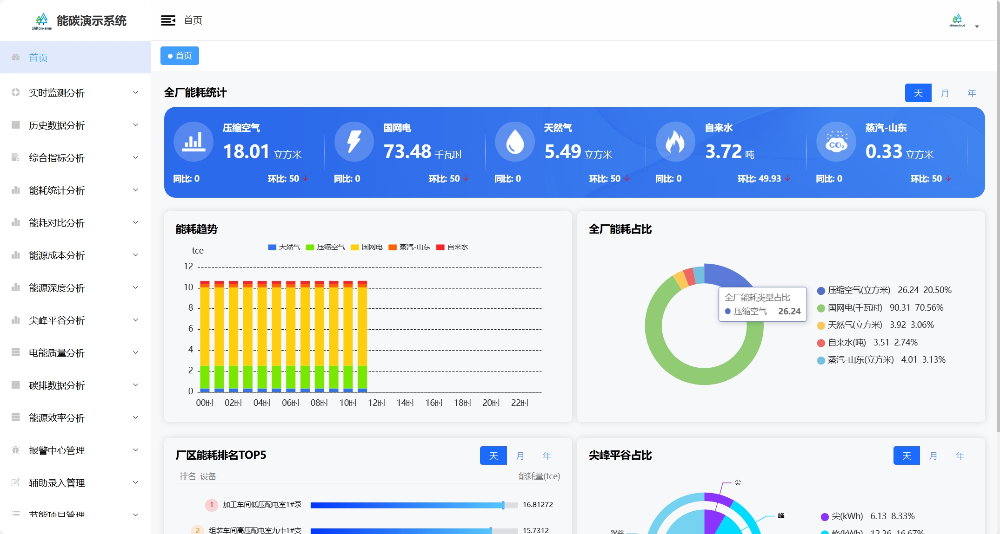
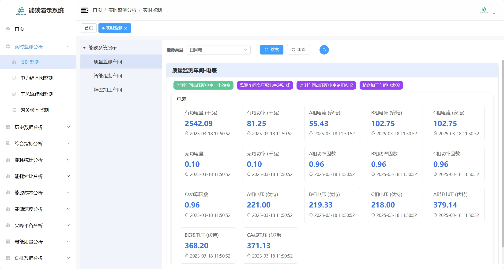
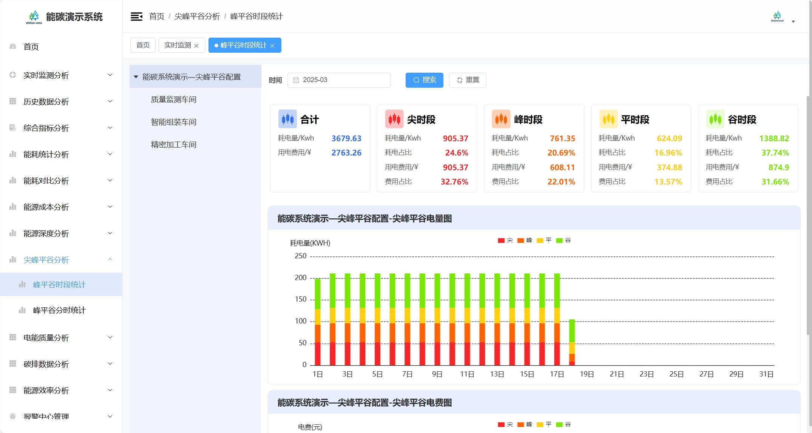
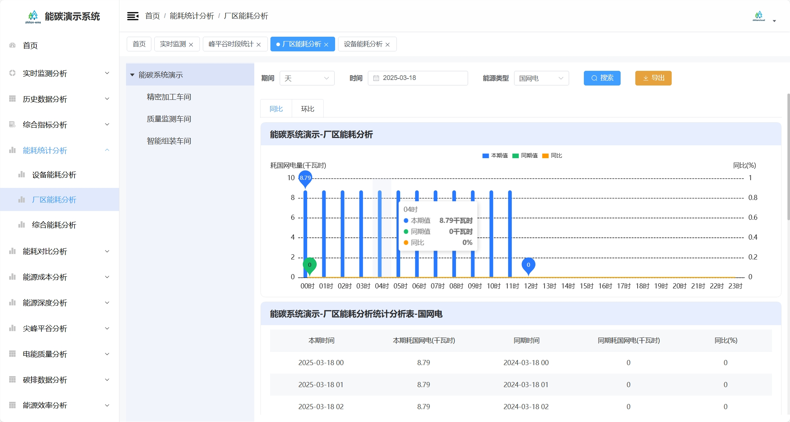
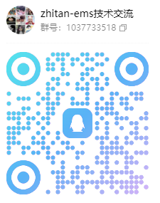

<div align="center">
    
</div>
<h1 align="center" style="margin: 30px 0 30px; font-weight: bold;">智碳能源管理系统</h1>
<h3 align="center">Zhitan Energy Carbon Management System</h3>

<p align="center">基于SpringBoot和若依框架开发的企业级能源管理解决方案</p>

<p align="center">
    <a href='https://gitee.com/liulingling1993/zhitan-ems/stargazers'></img></a>
    <a href='https://gitee.com/liulingling1993/zhitan-ems/members'></img></a>
    <a href="#"></a>
    <a href="#"></a>
</p>

## 目录

- [项目简介](#项目简介)
- [核心亮点](#核心亮点)
- [核心功能](#核心功能)
- [在线演示](#在线演示)
- [系统截图](#系统截图)
- [系统架构](#系统架构)
- [技术栈](#技术栈)
- [快速开始](#快速开始)
- [文档导航](#文档导航)
- [开源协议](#开源协议)
- [社区交流](#社区交流)
- [参与贡献](#参与贡献)

## 项目简介

智碳能源管理系统（Zhitan EMS）是一款面向政府、园区、企业等用户的综合能源管理解决方案。
系统以工信部印发《工业企业和园区数字化能碳管理中心建设指南》为参考，通过采集水、电、气、热、碳、光、储、充等多种数据，帮助工业企业和园区建立完善的能源管理体系，
实现对能耗和碳排放的精准化计量、精细化管控、智能化决策与可视化呈现，持续提升节能降碳管理能力，有效支撑能源利用效率提升和碳排放降低，为节能减排提供科学依据，促进绿色低碳转型。
本系统致力于支持中国碳达峰、碳中和目标，助力企业实现碳跟踪、碳盘查、碳交易、碳汇报的全生命周期管理。

## 核心亮点


## 核心功能

### 📊 社区版功能
- ✅ 首页看板 - 实时展示关键能源指标和统计数据
- ✅ 实时数据监测 - 实时查看能源消耗数据和组态图分析
- ✅ 历史数据分析 - 查看历史点位数据进行趋势分析
- ✅ 综合指标分析 - 日/月/年度综合能耗分析报告
- ✅ 重点设备分析 - 关键设备能耗监测与分析
- ✅ 工序能耗分析 - 生产工序能耗分布与效率评估
- ✅ 尖峰平谷分析 - 电价时段统计与优化建议
- ✅ 能耗对比分析 - 各能源品种同环比分析
- ✅ 建筑能耗分析 - 支路与分项建筑能耗详细分析
- ✅ 智能报警系统 - 异常能耗预警与报警管理
- ✅ 数据补录功能 - 手动补充缺失数据记录
- ✅ 节能项目管理 - 节能改造项目跟踪
- ✅ 知识库系统 - 能源管理知识与最佳实践共享
- ✅ 设备档案管理 - 能耗设备信息维护与管理
- ✅ 模型配置管理 - 计算模型与业务模型自定义配置
- ✅ 基础数据管理 - 字典、能源类型等基础信息维护
- ✅ 系统权限管理 - 用户、角色、权限统一管控

### 💎 增强版功能（商业版,功能需定制开发）
- 🚀 单耗分析 - 产品单产能耗深度分析
- 🚀 计划与实绩对比 - 能耗计划执行情况追踪
- 🚀 用能考核体系 - 建立科学的用能考核机制
- 🚀 用能对标分析 - 行业标杆对比与差距分析
- 🚀 空调节能优化 - 建筑空调系统节能策略
- 🚀 能源平衡分析 - 能源供应与消耗平衡图表
- 🚀 能源对标分析 - 与行业标准或历史数据对标
- 🚀 重点设备节能 - 空压机等设备专项节能方案
- 🚀 碳管理体系 - 碳盘查、碳路径规划、排放因子管理
- 🚀 源网荷储协同 - 微电网能量协调优化控制
- 🚀 低碳园区建设 - 园区级低碳发展解决方案
- 🚀 自定义报表 - 灵活配置各类分析报表
- 🚀 成本效益分析 - 能源成本构成与优化分析
- 🚀 光伏运维监控 - 光伏发电系统运行状态监控
- 🚀 充电运营管理 - 新能源汽车充电设施运营

## 在线演示

演示地址：[https://demo-ems.zhitancloud.com/](https://demo-ems.zhitancloud.com/)

> ⚠️ 注意：演示环境仅提供部分功能预览，且为只读权限。

## 系统截图

### 登录页面


### 首页展示（浅色主题）


### 首页展示（深色主题）


### 实时监测（浅色主题）


### 实时监测（深色主题）


### 尖峰平谷分析


### 区域能耗分析


## 系统架构

> 更完整的多模块职责、依赖关系与数据流向说明，见独立文档：[系统架构文档](docs/architecture.md)。

### 整体架构说明

完整的能碳管理平台由三个核心组件构成：

1. **能碳平台后台管理端** (本项目,不含数据清洗服务) - 提供后台管理界面及API接口，如需**面向中小型客户定制开发版本**请移步仓库：[zhitan-ems-plus版](https://gitee.com/liulingling1993/zhitan-ems-plus)。
2. **数据采集程序** - MQTT网关负责从现场设备采集数据并存储到时序数据库。请参考我们另一个仓库：[MQTT采集网关](https://gitee.com/liulingling1993/zhitan-gateway)
3. **数据清洗服务** - 定期将时序数据转换并存储到关系型数据库用于分析。学习者可以使用java自带的XXL job等计划任务工具自己按照业务功能，来实现数据清洗服务。

### 项目结构
```
zhitan-ems/
├── bin/                          # 批处理脚本目录
│   ├── clean.bat                 # 清理脚本
│   ├── package.bat               # 打包脚本
│   └── run.bat                   # 运行脚本
├── zhitan-admin/                 # 主应用模块
│   └── src/main/
│       ├── java/com/zhitan/web/  # Web控制器
│       ├── java/com/zhitan/AdminApplication.java     # Spring Boot主类
│       ├── java/com/zhitan/AdminServletInitializer.java
│       └── resources/            # 配置文件
│           ├── application*.yml  # 环境配置文件
│           ├── banner.txt        # 应用横幅
│           ├── logback.xml       # 日志配置
│           └── mybatis/          # MyBatis映射文件
├── zhitan-common/                # 公共工具和共享组件
│   └── src/main/java/com/zhitan/common/
│       ├── annotation/           # 自定义注解
│       ├── config/               # 公共配置
│       ├── constant/             # 常量定义
│       ├── core/                 # 核心组件(控制器、领域模型等)
│       ├── enums/                # 枚举类型
│       ├── exception/            # 异常处理
│       ├── filter/               # 过滤器(XSS、重复请求等)
│       ├── utils/                # 工具类
│       └── xss/                  # XSS防护组件
├── zhitan-framework/             # 框架组件
│   └── src/main/java/com/zhitan/framework/
│       ├── aspectj/              # 面向切面编程组件
│       ├── config/               # 配置类
│       ├── datasource/           # 数据源管理
│       ├── interceptor/          # 拦截器
│       ├── manager/              # 管理组件
│       ├── mqtt/                 # MQTT消息支持
│       ├── security/             # 安全组件
│       ├── sms/                  # 短信功能
│       └── web/                  # Web相关组件
├── zhitan-generator/             # 代码生成模块
├── zhitan-quartz/                # 定时任务模块
├── zhitan-system/                # 系统管理模块
└── zhitan-vue/                   # 前端应用(Vue.js)
    ├── html/                     # HTML文件
    ├── src/                      # 源码目录
    │   ├── api/                  # API客户端
    │   ├── assets/               # 静态资源
    │   ├── components/           # Vue组件
    │   ├── directive/            # Vue指令
    │   ├── layout/               # 布局组件
    │   ├── plugins/              # 插件
    │   ├── router/               # 路由配置
    │   ├── store/                # Pinia 状态管理
    │   ├── utils/                # 前端工具
    │   ├── views/                # 视图组件
    │   ├── App.vue               # 根Vue组件
    │   ├── main.js               # 入口文件
    │   ├── permission.js         # 权限控制
    │   └── settings.js           # 应用设置
    ├── vite/plugins/             # Vite构建插件
    ├── index.html                # 主HTML文件
    ├── package.json              # Node.js依赖
    └── vite.config.js            # Vite配置

```

## 技术栈

### 后端技术
- 核心框架：Spring Boot + Ruoyi Framework
- 数据库：PostgreSQL (推荐), MySQL (需自行适配)
- 时序数据库：InfluxDB 2.7+
- 缓存中间件：Redis
- 任务调度：Quartz
- 消息通信：MQTT
- 安全框架：Spring Security
- 接口文档：Swagger

### 前端技术
- 主框架：Vue 3 + Element Plus
- 构建工具：Vite
- 状态管理：Pinia
- 路由管理：Vue Router
- 图表库：ECharts
- UI主题：支持深色/浅色模式切换

## 快速开始

> 推荐阅读完整指南：[快速开始指南](docs/快速开始指南文档.md)。Docker / 源码 / 前端专项部署见下方[文档导航](#文档导航)。

### 环境要求
- JDK 1.8+
- Maven 3.0+
- PostgreSQL 14+
- Redis 5.0+
- InfluxDB 2.7+
- Node.js 18+（Vite 5 要求）

### 安装步骤

1. 克隆项目代码：

```bash
git clone https://gitee.com/liulingling1993/zhitan-ems.git
```

2. 导入数据库脚本：执行 `sql/public-v3.sql` 初始化 PostgreSQL。

3. 修改配置文件：按环境调整 `zhitan-admin/src/main/resources/` 下相关配置（数据源、Redis、InfluxDB、MQTT 等）。

4. 编译和启动：

后端：

```bash
mvn clean install
cd zhitan-admin
mvn spring-boot:run
```

前端：

```bash
cd zhitan-vue
yarn install
yarn run dev
```

5. 访问系统：`http://localhost`（默认账号 `admin` / `123456`）

## 文档导航

仓库内独立文档索引如下（持续补充中）：

### 入门与部署

| 文档 | 说明 |
|------|------|
| [快速开始指南](docs/快速开始指南文档.md) | 5 分钟上手：环境要求、启动步骤 |
| [源码部署文档](docs/source-deployment.md) | 非 Docker 全量源码编译与部署 |
| [前端部署文档](docs/frontend-deployment.md) | Vue3 构建、打包与 Nginx 配置 |
| [环境配置说明](docs/env-configuration.md) | `.env.file` 与前后端环境变量详解 |

### 架构与数据

| 文档 | 说明 |
|------|------|
| [系统架构文档](docs/architecture.md) | 多模块职责、依赖关系、数据流向 |
| [数据库设计文档](docs/database-design.md) | 核心表结构、字段与索引说明 |

### 规划与协作

| 文档 | 说明 |
|------|------|
| [持续更新计划](docs/UPDATE_PLAN.md) | 测试与文档迭代的 60 天计划 |

### 在线 Wiki 与 API

- GitHub Wiki：[https://github.com/zhitancloud/zhitan-ems/wiki](https://github.com/zhitancloud/zhitan-ems/wiki)
- Gitee Wiki：[https://gitee.com/liulingling1993/zhitan-ems/wikis/](https://gitee.com/liulingling1993/zhitan-ems/wikis/)
- 本地 Swagger：部署后端后访问 [http://localhost:8080/swagger-ui/index.html](http://localhost:8080/swagger-ui/index.html)

## 开源协议
zhitan-ems 是基于 [AGPL](https://www.gnu.org/licenses/agpl-3.0.en.html) 和 [ZTPL](./LICENSE) 双协议的开源软件。您在使用、修改、复制、分发本项目时，仔细阅读并理解以下该协议条款。

如果您属于以下情况，请遵循[AGPL](https://www.gnu.org/licenses/agpl-3.0.en.html)协议

- 您是个人开发者、研究机构或教育机构，希望技术学习、研究或非商业性地使用本项目。
- 您希望基于本项目进行修改或扩展，并愿意将您的修改成果同样开源给社区。

如果您是学生或者教师，用于技术学习或教学目的，可联系我们，我们将免费提供培训与指导（远程）

如果您属于以下情况，需要获得[ZTPL](./LICENSE)协议许可

- 您基于本项目的修改版本用于商业目的，但不希望公开您的项目代码。

- 您在一个内部使用的系统中集成了本项目，只对组织内部使用，不打算将其对外提供服务。

- 您计划将本项目打包成SaaS产品或云服务进行销售。

- 您需要在专有/闭源产品中集成、修改或链接本项目的代码。

- 您需要自行部署系统并运营，对外部用户提供收费服务。

如何获得[ZTPL](./LICENSE)协议许可？

您需要通过官方渠道，包括不限于：微信、QQ群等与我们取得联系，这样确保您秉持开源精神同时，获得商业许可的自由，并能得到我们官方的技术支持

## 版权须知
本软件项目（包括但不限于源代码、文档、图片、配置等所有构成项目的材料）的原始版权和知识产权归 [青岛智碳未来科技有限公司] 所有。我们保留对本项目名称、品牌、Logo、专利以及商业许可的所有权利。未经明确授权，任何个人或组织不得使用与本项目相关的名称、标识进行商业性宣传或推广。

## 社区交流

我们非常欢迎您的参与和反馈！

### QQ群交流
如果您只是技术学习与咨询等，请加入我们的QQ群：1037733518 请备注：ems+姓名

<p align="center">
  
</p>

### 微信交流
如果您要想咨询我们的商业授权，以及培训等事宜，请优先加微信，请备注：ems+姓名

<p align="center">
  
</p>
<p align="center">
  
</p>

## 参与贡献

我们热烈欢迎任何形式的贡献！

### 贡献流程
1. Fork 本仓库
2. 创建功能分支 (`git checkout -b feature/AmazingFeature`)
3. 提交更改 (`git commit -m 'Add some AmazingFeature'`)
4. 推送到分支 (`git push origin feature/AmazingFeature`)
5. 发起 Pull Request

### 开发规范
- 遵循项目现有的代码风格
- 添加适当的注释和文档
- 确保所有测试通过
- 提交前进行充分测试

### 报告问题
如果您发现任何问题，请在 Issues 中提交，并附上详细的描述和重现步骤。   

---

<p align="center">
  <strong>© 2025 智碳未来 - 为地球降1℃ </strong>
</p>