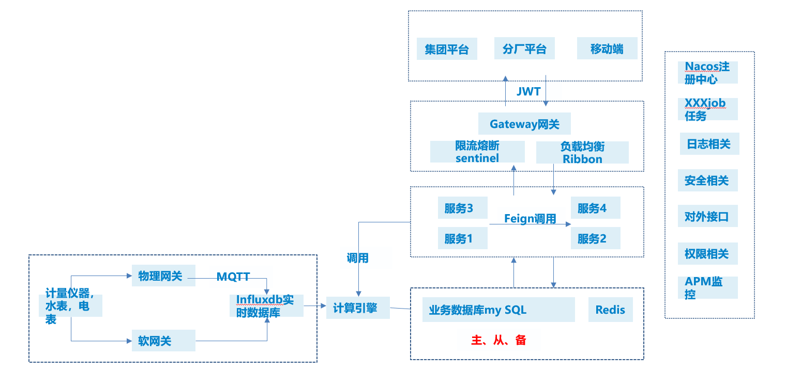
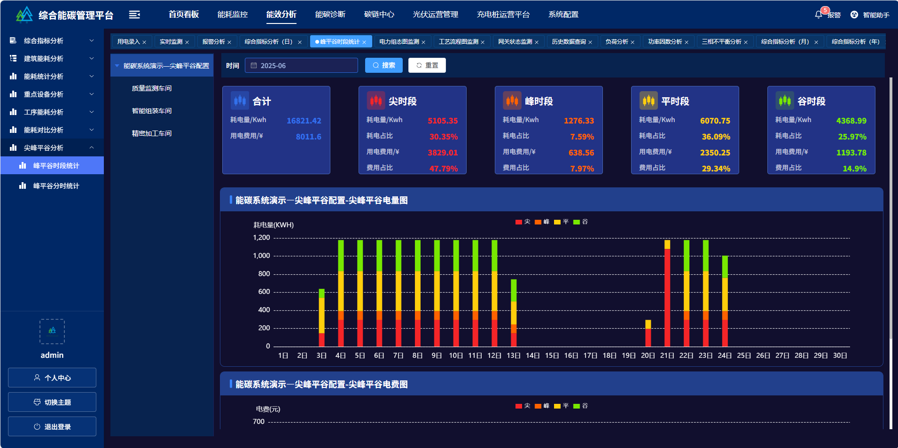
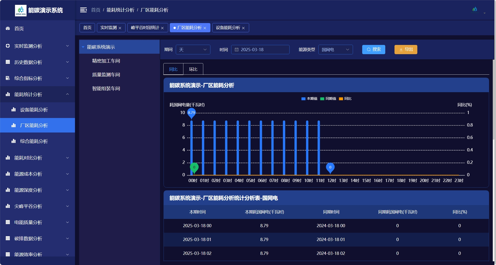

<div align="center">
    
</div>

<h1 align="center">智碳能源管理系统</h1>

<p align="center">
    <strong>生产级能源管理平台 | 完整开源 | 开箱即用</strong>
</p>

<p align="center">
    <a href="https://gitee.com/liulingling1993/zhitan-ems/stargazers">
        
    </a>
    <a href="https://gitee.com/liulingling1993/zhitan-ems/members">
        
    </a>
    
    
    
</p>

<p align="center">
    <a href="#-快速开始">快速开始</a> •
    <a href="#-核心特性">核心特性</a> •
    <a href="#-技术架构">技术架构</a> •
    <a href="#-在线演示">在线演示</a> •
    <a href="#-参与贡献">参与贡献</a>
</p>

---

## 📖 项目简介

智碳能源管理系统是一个**生产级、企业级**的能源管理平台，专注于工业企业的能耗数据采集、分析和优化。

### 为什么选择本项目？

- ✅ **完整开源**: 后台管理端代码完全开源，无任何功能阉割
- ✅ **生产验证**: 已在多个工业企业实际部署运行
- ✅ **技术先进**: SpringBoot + Vue3 + PostgreSQL + InfluxDB 时序数据库
- ✅ **功能完善**: 22+ 核心功能模块，覆盖能源管理全流程
- ✅ **易于扩展**: 模块化设计，支持二次开发和定制
- ✅ **学习价值**: 适合学习工业物联网、时序数据处理、能源管理业务

### 适用场景

- 🏭 **工业企业**: 制造业、化工、钢铁、水泥等高耗能企业
- 🏢 **商业建筑**: 写字楼、商场、酒店等公共建筑能耗管理
- 🏫 **园区管理**: 工业园区、科技园区的综合能源管理
- 🎓 **教学科研**: 高校能源管理专业教学、毕业设计参考

### 注意事项
#### 【注意1】完整能碳管理平台包含三个部分，<span style="color: red;">本仓库只包含能碳平台后台管理端</span>
- 1. 能碳平台后台管理端：<span style="color: red;">也即本项目能碳平台后台展示部分，代码完备，运行正常。通过本项目，学习者可以掌握能源管理行业的功能和业务，以及技术架构。</span>
- 2. 数据采集程序：也即mqtt➡️时序库功能，请参考[我们另一个仓库（点击超链接），MQTT采集网关](https://gitee.com/liulingling1993/zhitan-gateway)；或者可参考thingsjs等知名项目，或者自己用netty自己实现。
- 3. 数据清洗服务：也即时序库➡️关系库，学习者可以使用java自带的XXL job等计划任务工具自己按照业务功能，来实现数据清洗服务。
#### 【注意2】本项目适合中大型能源管理项目定制开发、扩展（多、复杂物模型配置，自动计算引擎，数据清洗，海量设备数据接入，灵活配置适配复杂客户业务场景）。面向中小型客户的我们会：
- 1. 最快将于2025年9月【开源】面向中小型的能管系统，届时大家可以免费使用。https://gitee.com/liulingling1993/zhitan-ems-plus
- 2. 或者联系我，使用我们的SAAS平台（支持免费改域名，改logo等），单项目5个仪表采集免费使用。

---

## 🚀 快速开始

### 环境要求

| 软件 | 版本 | 必需 |
|------|------|------|
| JDK | 1.8+ | ✅ |
| Maven | 3.6+ | ✅ |
| PostgreSQL | 12+ | ✅ |
| InfluxDB | 2.7+ | ✅ |
| Redis | 5.0+ | ✅ |
| Node.js | 16+ | ✅ |

### 5分钟快速启动

```bash
# 1. 克隆项目
git clone https://gitee.com/liulingling1993/zhitan-ems.git
cd zhitan-ems

# 2. 导入数据库
psql -U postgres -d zhitan_ems -f sql/public.sql

# 3. 修改配置
# 编辑 zhitan-admin/src/main/resources/application-dev.yml
# 修改数据库连接、Redis、InfluxDB 配置

# 4. 启动后端
cd zhitan-admin
mvn spring-boot:run

# 5. 启动前端
cd ../zhitan-vue
npm install
npm run dev

# 6. 访问系统
# http://localhost:80
# 账号: admin  密码: admin123
```

### 详细文档

- 📘 [新手开发者快速上手指南](./新手开发者快速上手指南.md) - 零基础入门，2小时搭建完成
- 📗 [快速开始指南](./快速开始指南.md) - 有基础开发者，30分钟快速启动
- 📙 [API 接口文档](https://demo-ems.zhitancloud.com/swagger-ui.html) - Swagger 在线文档

---

## ⭐ 核心特性

### 1. 实时数据监测

- 🔴 **实时采集**: 支持 MQTT、Modbus、OPC UA 等多种协议
- 📊 **可视化展示**: SVG 组态图、实时曲线、数字仪表盘
- ⚡ **高性能**: InfluxDB 时序数据库，支持百万级数据点

### 2. 历史数据分析

- 📈 **多维度分析**: 日、月、年多时间维度对比
- 🔍 **同环比分析**: 自动计算同比、环比增长率
- 📉 **趋势预测**: 基于历史数据的能耗趋势预测

### 3. 智能报警系统

- 🚨 **多级报警**: 支持上限、下限、上上限、下下限
- 📱 **多渠道通知**: 短信、邮件、微信、钉钉
- 🎯 **灵活配置**: 可按时段、设备、指标灵活配置

### 4. 能耗成本分析

- 💰 **尖峰平谷**: 支持分时电价计算
- 📊 **成本分摊**: 按车间、设备、产品分摊能源成本
- 📉 **节能效果**: 量化节能措施的经济效益

### 5. 碳排放管理

- 🌱 **碳盘查**: 基于能耗数据自动计算碳排放
- 📋 **碳报告**: 自动生成碳排放报告
- 🎯 **碳达峰**: 碳达峰、碳中和路径规划

### 6. 灵活的数据模型

- 🏗️ **树形结构**: 企业 → 车间 → 设备的层级管理
- 🔧 **计算引擎**: 支持自定义计算公式
- 📐 **物模型**: 灵活的设备物模型配置

---

## 🏗️ 技术架构

### 后端技术栈

```
核心框架: SpringBoot 2.5.15
安全框架: Apache Shiro
持久层: MyBatis Plus 3.5.6
数据库: PostgreSQL 12+ (关系型) + InfluxDB 2.7+ (时序)
缓存: Redis 5.0+
消息队列: MQTT (可选)
定时任务: Quartz
接口文档: Swagger 3.0
```

### 前端技术栈

```
核心框架: Vue 3.3.9
UI 框架: Element Plus 2.4.3
状态管理: Pinia 2.1.7
路由管理: Vue Router 4.2.5
图表库: ECharts 5.4.3
构建工具: Vite 5.0.4
```

### 项目结构

```
zhitan-ems/
├── zhitan-admin/          # 主启动模块 (Spring Boot 入口)
├── zhitan-common/         # 通用工具类 (工具类、常量、枚举)
├── zhitan-framework/      # 框架核心 (Shiro、Redis、异常处理)
├── zhitan-generator/      # 代码生成器 (快速生成 CRUD)
├── zhitan-quartz/         # 定时任务 (数据清洗、统计)
├── zhitan-system/         # 系统管理 (用户、角色、权限)
├── zhitan-vue/            # 前端项目 (Vue3 + Element Plus)
├── sql/                   # 数据库脚本
│   └── public.sql        # PostgreSQL 初始化脚本
└── bin/                   # 启动脚本
    ├── run.bat           # Windows 启动
    ├── package.bat       # 打包脚本
    └── clean.bat         # 清理脚本
```

### 系统架构图



---

## 🎯 功能清单

### 已完成功能 (22个核心模块)

| 模块 | 功能 | 状态 |
|------|------|------|
| 📊 首页看板 | 能耗概览、成本看板、储能看板、报警看板 | ✅ |
| 🔴 实时监测 | 实时数据、组态图、网关状态 | ✅ |
| 📈 历史分析 | 历史点位、综合指标、重点设备 | ✅ |
| ⚡ 尖峰平谷 | 分时电价配置、峰谷统计 | ✅ |
| 📉 能耗对比 | 同环比分析、多能源对比 | ✅ |
| 🚨 智能报警 | 报警配置、报警分析、报警记录 | ✅ |
| 📝 数据补录 | 手动补录、批量导入 | ✅ |
| 💡 节能管理 | 节能项目、节能效果评估 | ✅ |
| 📚 知识库 | 政策法规、技术文档 | ✅ |
| 🔧 设备档案 | 设备管理、计量器具 | ✅ |
| 🏗️ 模型配置 | 数据模型、计算公式 | ✅ |
| 📋 基础数据 | 字典管理、能源类型 | ✅ |
| 👥 系统管理 | 用户、角色、权限、菜单 | ✅ |
| 🏢 建筑能耗 | 支路分析、分项分析 | ✅ |
| 🔋 智慧储能 | 储能监测、储能配置、储能统计 | ✅ |
| 💰 成本分析 | 能源成本、成本分摊 | ✅ |
| 🌊 能流分析 | 能源流向、桑基图 | ✅ |
| 🌱 碳排放 | 碳盘查、碳报告 | ✅ |
| 📊 单耗分析 | 单位产品能耗、能效对标 | ✅ |
| 🔄 工序能耗 | 工序级能耗分析 | ✅ |
| 🎯 重点设备 | 重点设备能耗监控 | ✅ |
| 📐 综合指标 | 多维度综合指标分析 | ✅ |

### 增强版功能 (商业版)

- 计划与实绩对比
- 用能考核管理
- 用能对标分析
- 建筑空调节能
- 能源平衡分析
- 空压机专项节能
- 碳路径规划
- 源网荷储（微电网）
- 低碳园区管理
- 自定义报表
- 光伏运维监控
- 充电运营平台

---

## 🎨 界面展示

### 深色主题

<table>
  <tr>
    <td></td>
    <td></td>
  </tr>
  <tr>
    <td></td>
    <td></td>
  </tr>
</table>

### 浅色主题

<table>
  <tr>
    <td></td>
    <td></td>
  </tr>
  <tr>
    <td></td>
    <td></td>
  </tr>
</table>

---

## 🌐 在线演示

**演示地址**: https://demo-ems.zhitancloud.com/

**测试账号**: 
- 账号: `admin`
- 密码: `admin123`

**注意**: 演示环境数据为模拟数据，仅供功能体验

---

## 📦 系统说明

### ⚠️ 重要说明

本仓库包含**能碳平台后台管理端**，完整的能源管理系统包含三个部分：

1. **后台管理端** (本项目) ✅
   - 数据展示、分析、报表
   - 系统配置、用户管理
   - 完全开源，代码完备

2. **数据采集网关** (独立项目)
   - MQTT → InfluxDB 数据采集
   - 支持多种工业协议
   - 参考项目: [zhitan-gateway](https://gitee.com/liulingling1993/zhitan-gateway)

3. **数据清洗服务** (需自行实现)
   - InfluxDB → PostgreSQL 数据清洗
   - 可使用 XXL-Job 等定时任务框架
   - 按业务需求自行开发

### 适用场景

- ✅ **中大型项目**: 复杂物模型、海量设备、定制化需求
- ✅ **学习研究**: 掌握能源管理业务和技术架构
- ✅ **二次开发**: 基于本项目进行定制开发

### 中小型项目方案

如果您的项目规模较小（设备数 < 100），推荐：

1. **开源版本** (2025年9月发布)
   - 面向中小型企业的简化版
   - 开箱即用，配置简单
   - 项目地址: https://gitee.com/liulingling1993/zhitan-ems-plus

2. **SaaS 平台** (免费试用)
   - 支持自定义域名、Logo
   - 5个仪表以内免费使用
   - 联系作者获取试用

---

## 🤝 参与贡献

### 贡献方式

我们欢迎任何形式的贡献：

- 🐛 **提交 Bug**: 发现问题请提 [Issue](https://gitee.com/liulingling1993/zhitan-ems/issues)
- 💡 **功能建议**: 有好的想法欢迎讨论
- 📝 **完善文档**: 帮助改进文档和示例
- 🔧 **提交代码**: Fork 项目并提交 Pull Request

### 贡献流程

```bash
# 1. Fork 本仓库
# 2. 创建特性分支
git checkout -b feature/your-feature

# 3. 提交代码
git commit -m "feat: add your feature"

# 4. 推送到分支
git push origin feature/your-feature

# 5. 提交 Pull Request
```

### 代码规范

- 遵循阿里巴巴 Java 开发手册
- 遵循 Vue 官方风格指南
- 提交前请格式化代码
- 编写清晰的注释和文档

### 贡献者

感谢所有为本项目做出贡献的开发者！

<a href="https://gitee.com/liulingling1993/zhitan-ems/contributors">
  
</a>

---

## 📄 开源协议

本项目基于 **AGPL-3.0** 和 **ZTPL** 双协议开源：

- ✅ **学习使用**: 学生学习、教师教学完全免费
- ✅ **个人项目**: 个人非商业项目可免费使用
- ⚠️ **商业使用**: 需要联系作者获取商业授权
- ⚠️ **二次开发**: 基于本项目的二次开发需保持开源

详细协议请查看: [LICENSE](./LICENSE)

---

## 💬 交流社区

### QQ 交流群


**入群请备注**: `ems+姓名`

### 微信交流


**添加请备注**: `ems+姓名`

### 技术支持

- 📧 **邮件**: 见 Gitee 主页
- 💬 **Issues**: [提交问题](https://gitee.com/liulingling1993/zhitan-ems/issues)
- 📖 **文档**: [在线文档](https://demo-ems.zhitancloud.com/doc)

---

## 🎓 学习资源

### 推荐学习路径

1. **基础知识** (1-2周)
   - Java 基础、Spring Boot
   - Vue 3、Element Plus
   - PostgreSQL、Redis

2. **项目实战** (2-3周)
   - 搭建开发环境
   - 理解项目结构
   - 运行和调试

3. **业务理解** (1-2周)
   - 能源管理业务流程
   - 数据采集和处理
   - 报表分析逻辑

4. **二次开发** (按需)
   - 添加自定义功能
   - 对接第三方系统
   - 性能优化

### 相关项目

- [zhitan-gateway](https://gitee.com/liulingling1993/zhitan-gateway) - MQTT 数据采集网关
- [若依框架](http://doc.ruoyi.vip/) - 基础框架文档
- [InfluxDB 文档](https://docs.influxdata.com/) - 时序数据库

---

## 📊 项目统计


---

## 🙏 致谢

感谢以下开源项目：

- [RuoYi-Vue](https://gitee.com/y_project/RuoYi-Vue) - 基础框架
- [Element Plus](https://element-plus.org/) - UI 组件库
- [ECharts](https://echarts.apache.org/) - 图表库
- [InfluxDB](https://www.influxdata.com/) - 时序数据库

---

## ⭐ Star History

如果这个项目对你有帮助，请给我们一个 Star ⭐

[](https://star-history.com/#liulingling1993/zhitan-ems&Date)

---

<div align="center">

**[⬆ 回到顶部](#智碳能源管理系统)**

Made with ❤️ by Zhitan Team

</div>
