<div align="center">
    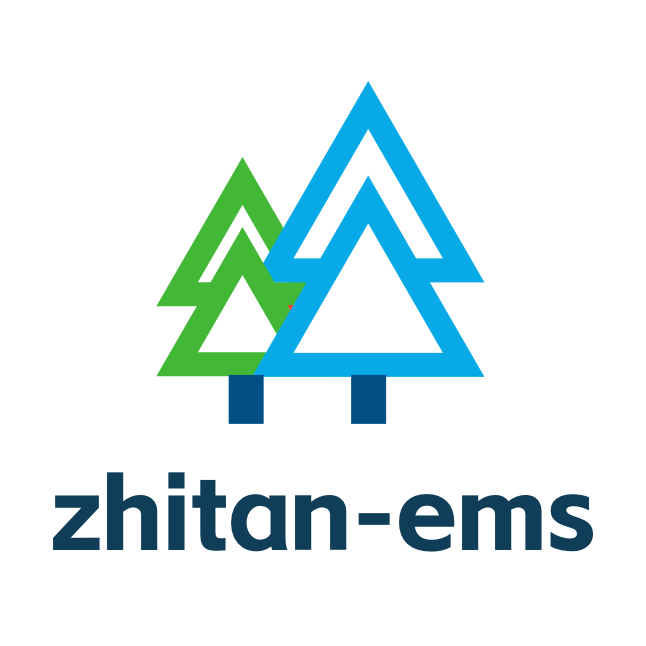
</div>
<p align="center"><a href="README_EN.md">English</a> | 中文</p>
<h1 align="center" style="margin: 30px 0 30px; font-weight: bold;">智碳能源管理系统</h1>
<h3 align="center">Zhitan Energy Carbon Management System</h3>

<p align="center">面向政府、园区、企业的全能源品种碳排放管理平台</p>

<p align="center">
    <a href='https://gitee.com/liulingling1993/zhitan-ems/stargazers'></img></a>
    <a href='https://gitee.com/liulingling1993/zhitan-ems/members'></img></a>
    <a href="#"></a>
    <a href="#"></a>
    <a href="#"></a>
    <a href="#"></a>
    <a href="#"></a>
</p>

---

## 目录

- [在线演示](#在线演示)
- [项目简介](#项目简介)
- [核心功能](#核心功能)
- [系统截图](#系统截图)
- [系统架构](#系统架构)
- [技术栈](#技术栈)
- [快速部署](#快速部署)
- [文档资源](#文档资源)
- [开源协议](#开源协议)
- [社区交流](#社区交流)
- [参与贡献](#参与贡献)

## 在线演示

演示地址：[https://demo-ems.zhitancloud.com/](https://demo-ems.zhitancloud.com/)

## 项目简介

智碳能源管理系统（Zhitan EMS）是一款面向政府、园区、企业等用户的综合能源管理解决方案。
系统以工信部印发《工业企业和园区数字化能碳管理中心建设指南》为参考，符合绿色工厂申报要求，通过采集水、电、气、热、碳、光、储、充等多种数据，帮助工业企业和园区建立完善的能源管理体系，
实现对能耗和碳排放的精准化计量、精细化管控、智能化决策与可视化呈现，持续提升节能降碳管理能力，有效支撑能源利用效率提升和碳排放降低，为节能减排提供科学依据，促进绿色低碳转型。
本系统致力于支持中国碳达峰、碳中和目标，助力企业实现碳跟踪、碳盘查、碳交易、碳汇报的全生命周期管理。

### 为什么选择智碳 EMS

- **全能源品种覆盖** — 水、电、气、热、碳、光、储、充，一个系统全搞定
- **开箱即用** — Docker Compose 一键部署，5 分钟体验完整系统
- **双主题支持** — 深色/浅色主题自由切换，适配大屏监控与日常办公
- **符合国标** — 参照工信部能碳管理中心建设指南，支撑绿色工厂申报
- **活跃维护** — 60 天持续更新计划进行中，社区反馈快速响应

## 核心功能

### 核心亮点

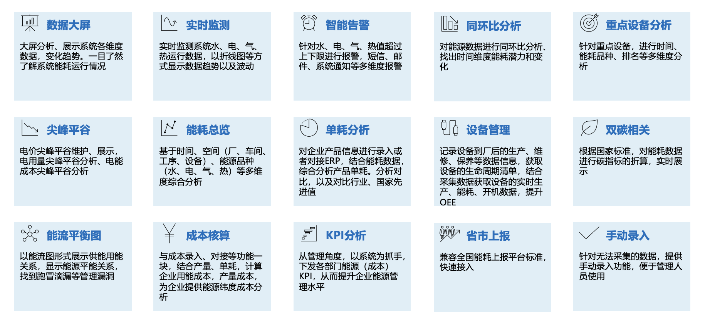

### 业务全景图

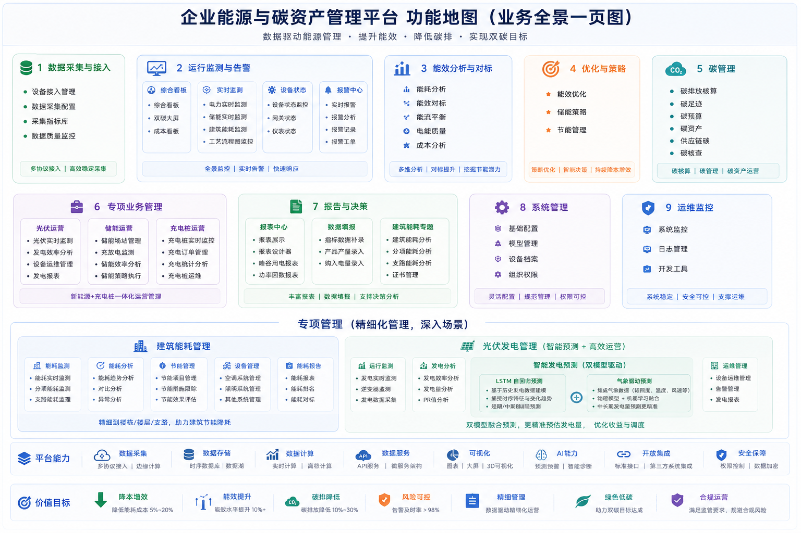

### 社区版功能 vs 增强版功能

#### 社区版（开源免费）

| 功能 | 说明 |
|------|------|
| 首页看板 | 实时展示关键能源指标和统计数据 |
| 实时数据监测 | 实时查看能源消耗数据和组态图分析 |
| 历史数据分析 | 查看历史点位数据进行趋势分析 |
| 综合指标分析 | 日/月/年度综合能耗分析报告 |
| 重点设备分析 | 关键设备能耗监测与分析 |
| 工序能耗分析 | 生产工序能耗分布与效率评估 |
| 尖峰平谷分析 | 电价时段统计与优化建议 |
| 能耗对比分析 | 各能源品种同环比分析 |
| 建筑能耗分析 | 支路与分项建筑能耗详细分析 |
| 智能报警系统 | 异常能耗预警与报警管理 |
| 数据补录功能 | 手动补充缺失数据记录 |
| 节能项目管理 | 节能改造项目跟踪 |
| 知识库系统 | 能源管理知识与最佳实践共享 |
| 设备档案管理 | 能耗设备信息维护与管理 |
| 模型配置管理 | 计算模型与业务模型自定义配置 |
| 基础数据管理 | 字典、能源类型等基础信息维护 |
| 系统权限管理 | 用户、角色、权限统一管控 |

#### 增强版（商业授权）

| 功能 | 说明 |
|------|------|
| 单耗分析 | 产品单产能耗深度分析 |
| 计划与实绩对比 | 能耗计划执行情况追踪 |
| 用能考核体系 | 建立科学的用能考核机制 |
| 用能对标分析 | 行业标杆对比与差距分析 |
| 空调节能优化 | 建筑空调系统节能策略 |
| 能源平衡分析 | 能源供应与消耗平衡图表 |
| 能源对标分析 | 与行业标准或历史数据对标 |
| 重点设备节能 | 空压机等设备专项节能方案 |
| 碳管理体系 | 碳盘查、碳路径规划、排放因子管理 |
| 源网荷储协同 | 微电网能量协调优化控制 |
| 低碳园区建设 | 园区级低碳发展解决方案 |
| 自定义报表 | 灵活配置各类分析报表 |
| 成本效益分析 | 能源成本构成与优化分析 |
| 光伏运维监控 | 光伏发电系统运行状态监控 |
| 充电运营管理 | 新能源汽车充电设施运营 |
| 能耗对标 | 基于工业重点领域能效标杆和基准水平的能耗对标 |
| 积木报表 | 集成积木报表设计器 |
| 单点登录 | 单点登录功能 |
| 多种能源品种 | 实时数据兼容多能源品种 |

> 增强版功能由商业版提供企业级解决方案，如需商业授权请联系微信（备注：ems+姓名）。

### 绿色工厂申报支撑能力

本系统紧扣国家绿色工厂「**用地集约化、原料无害化、生产洁净化、废物资源化、能源低碳化**」的五化评价导向，可在绿色工厂申报中为企业提供**能源与碳排放管理维度**的数据支撑：

- **能耗在线监测与精准计量**：对水、电、气、热及光伏、储能、充电等多能源品种进行实时采集与精准计量
- **碳排放管理**：提供碳盘查、碳排放因子管理、碳路径规划等能力
- **能源管理体系落地**：通过综合指标分析、尖峰平谷、单耗分析、用能考核与对标，帮助企业建立并规范运行能源管理体系
- **可再生能源与源网荷储**：光伏运维监控、充电运营管理、源网荷储协同等能力
- **可视化报表与证据留存**：自定义报表可将数据一键生成申报所需的图表与台账

> 说明：绿色工厂申报的「五化」涉及用地、原料、生产、废物等多维度，本系统主要覆盖其中的**能源低碳化与碳排放管理**相关指标；其余维度建议结合企业现场管理台账一并提交。具体申报口径请以最新《绿色工厂评价要求》及主管部门要求为准。

## 系统截图

### 登录页面

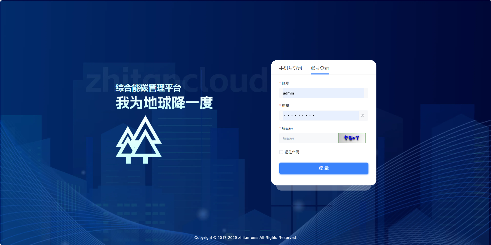

### 首页展示

<table>
  <tr>
    <td align="center"><b>深色主题</b></td>
    <td align="center"><b>浅色主题</b></td>
  </tr>
  <tr>
    <td>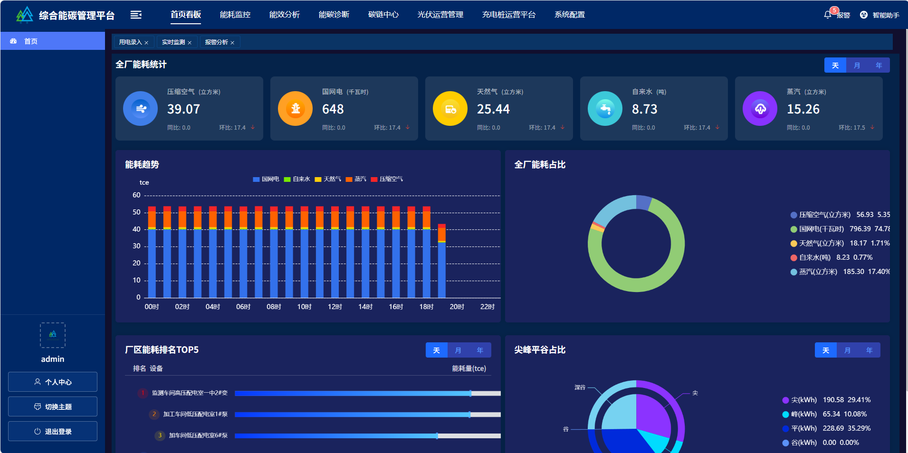</td>
    <td>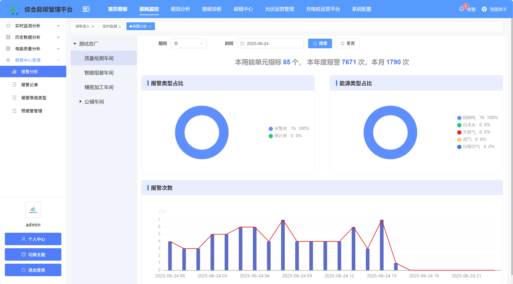</td>
  </tr>
</table>

### 首页看板

<table>
  <tr>
    <td align="center"><b>成本看板</b></td>
    <td align="center"><b>储能看板</b></td>
    <td align="center"><b>告警看板</b></td>
  </tr>
  <tr>
    <td>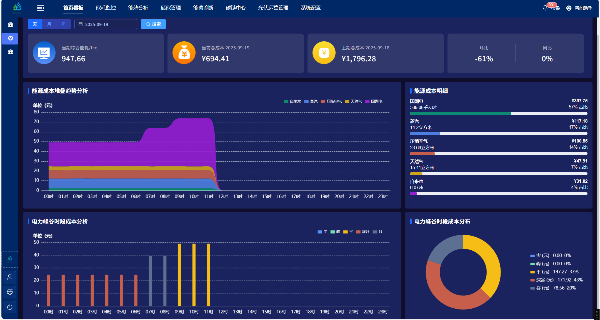</td>
    <td>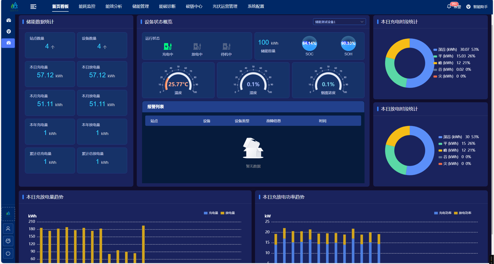</td>
    <td>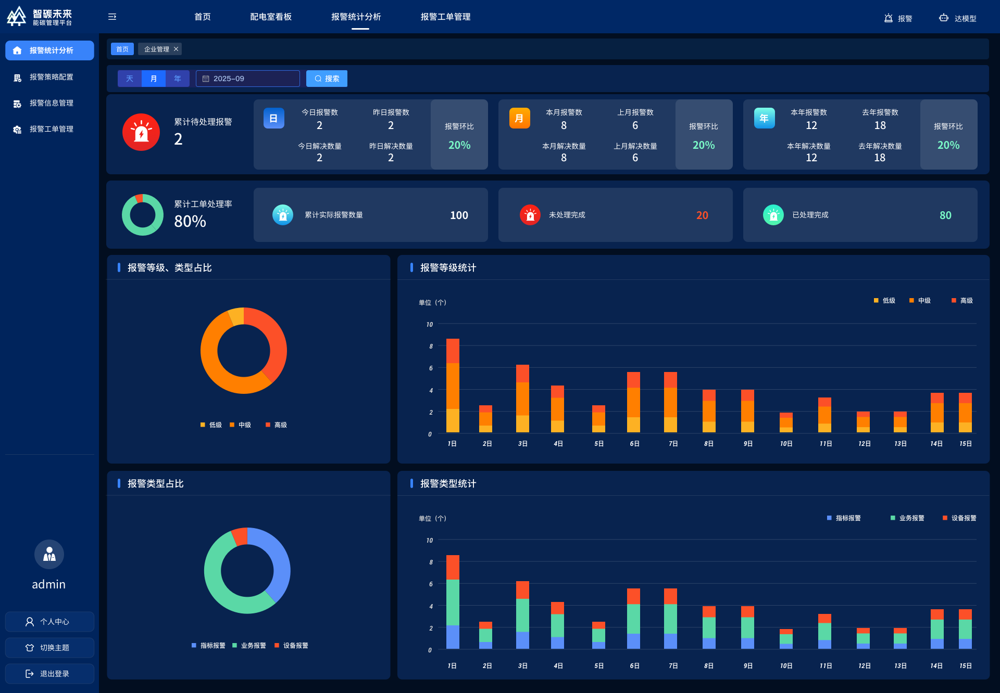</td>
  </tr>
</table>

### 实时监测

<table>
  <tr>
    <td align="center"><b>深色主题</b></td>
    <td align="center"><b>浅色主题</b></td>
  </tr>
  <tr>
    <td>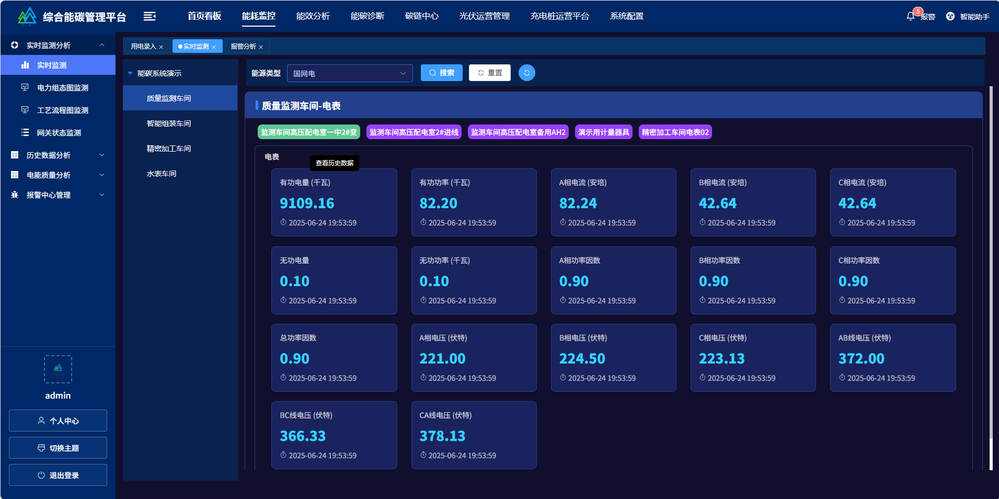</td>
    <td>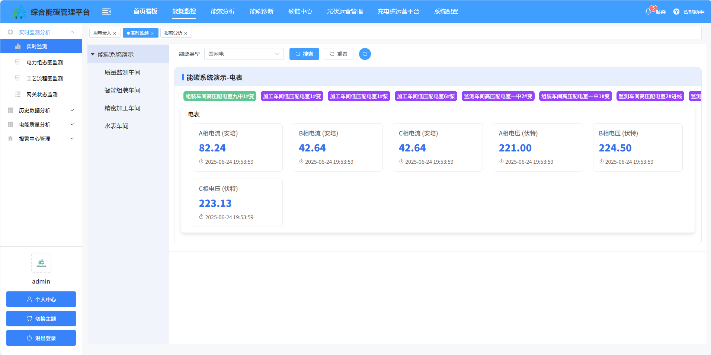</td>
  </tr>
</table>

### 区域能耗分析

<table>
  <tr>
    <td align="center"><b>浅色主题</b></td>
    <td align="center"><b>深色主题</b></td>
  </tr>
  <tr>
    <td>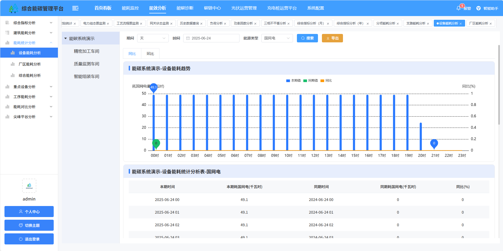</td>
    <td>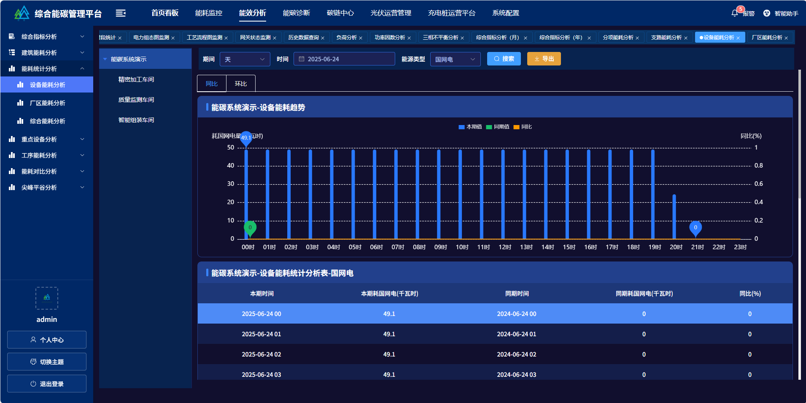</td>
  </tr>
</table>

### 尖峰平谷分析

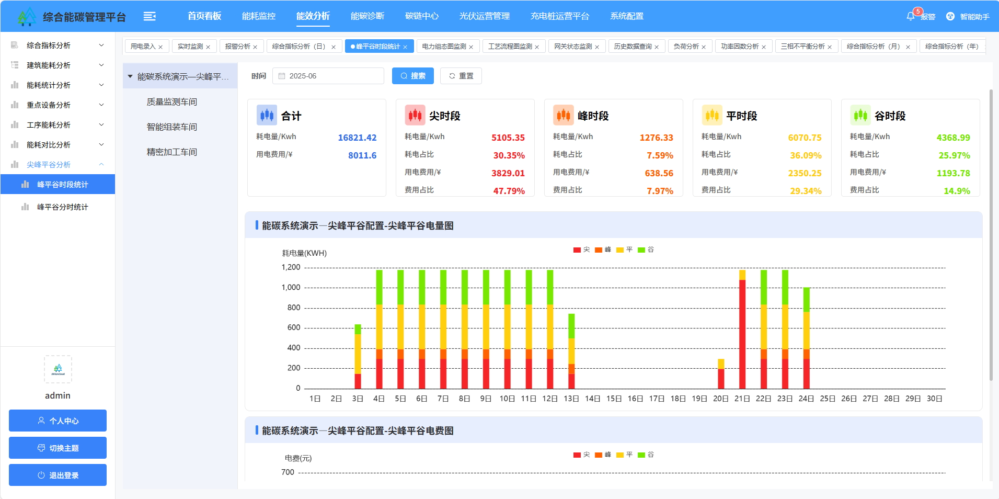

## 系统架构

### 整体架构说明

完整的能碳管理平台由三个核心组件构成：

1. **能碳平台后台管理端**（本项目，不含数据清洗服务）- 提供后台管理界面及API接口。如需**面向中小型客户定制开发版本**请移步仓库：[zhitan-ems-mini版](https://gitee.com/liulingling1993/zhitan-ems-mini)。
2. **数据采集程序** - MQTT网关负责从现场设备采集数据并存储到时序数据库。请参考我们另一个仓库：[MQTT采集网关](https://gitee.com/liulingling1993/zhitan-gateway)。
3. **数据清洗服务** - 定期将时序数据转换并存储到关系型数据库用于分析。学习者可以使用Java自带的XXL-JOB等计划任务工具按照业务功能自行实现数据清洗服务。

### 业务架构

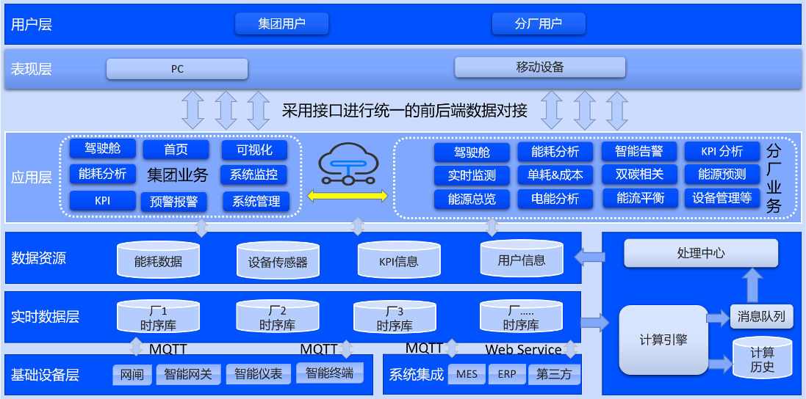

### 技术架构


### 项目结构

```
zhitan-ems/
├── zhitan-api/                     # 后端工程（Maven多模块）
│   ├── zhitan-admin/               # 主应用模块（启动类 + Web控制器）
│   │   └── src/main/
│   │       ├── java/com/zhitan/web/  # Web控制器
│   │       ├── java/com/zhitan/AdminApplication.java  # Spring Boot启动类
│   │       └── resources/            # 配置文件（application.yml、mybatis等）
│   ├── zhitan-common/              # 公共工具和共享组件
│   │   └── src/main/java/com/zhitan/common/
│   │       ├── annotation/         # 自定义注解
│   │       ├── config/             # 公共配置
│   │       ├── constant/           # 常量定义
│   │       ├── core/               # 核心组件（控制器、领域模型等）
│   │       ├── enums/              # 枚举类型
│   │       ├── exception/         # 异常处理
│   │       ├── filter/             # 过滤器（XSS、重复请求等）
│   │       ├── utils/              # 工具类
│   │       └── xss/                # XSS防护组件
│   ├── zhitan-framework/           # 框架组件
│   │   └── src/main/java/com/zhitan/framework/
│   │       ├── aspectj/            # 面向切面编程组件
│   │       ├── config/             # 配置类
│   │       ├── datasource/         # 数据源管理
│   │       ├── interceptor/        # 拦截器
│   │       ├── manager/            # 管理组件
│   │       ├── mqtt/               # MQTT消息支持
│   │       ├── security/           # 安全组件
│   │       ├── sms/                # 短信功能
│   │       └── web/                # Web相关组件
│   ├── zhitan-generator/           # 代码生成模块
│   ├── zhitan-quartz/              # 定时任务模块
│   ├── zhitan-system/              # 业务模块（31个业务子模块）
│   ├── bin/                        # 批处理脚本（clean/package/run）
│   ├── sql/                        # 数据库初始化脚本
│   │   └── public-v3.sql           # PostgreSQL初始化SQL
│   ├── pom.xml                     # 父POM
│   └── Dockerfile                  # 后端镜像构建文件
├── zhitan-web/                     # 前端工程（Vue3 + Vite）
│   ├── src/                        # 前端源码
│   │   ├── api/                    # API客户端
│   │   ├── assets/                 # 静态资源
│   │   ├── components/             # Vue组件
│   │   ├── directive/              # Vue指令
│   │   ├── layout/                 # 布局组件
│   │   ├── plugins/                 # 插件
│   │   ├── router/                 # 路由配置
│   │   ├── store/                  # Pinia状态管理
│   │   ├── utils/                  # 前端工具
│   │   ├── views/                  # 视图组件
│   │   ├── App.vue                 # 根组件
│   │   ├── main.js                 # 入口文件
│   │   ├── permission.js           # 权限控制
│   │   └── settings.js             # 应用设置
│   ├── vite/plugins/               # Vite构建插件
│   ├── index.html                  # 主HTML文件
│   ├── package.json                 # Node.js依赖
│   ├── nginx.conf                   # Nginx配置
│   ├── vite.config.js               # Vite配置
│   └── Dockerfile                   # 前端镜像构建文件
├── docs/                           # 项目文档
│   └── UPDATE_PLAN.md               # 持续更新计划
├── images/                         # README图片资源
├── .env.file                       # 环境变量配置模板
├── docker-compose.yml              # Docker Compose一键部署
├── docker.md                       # Docker部署详细指南
├── README.md                       # 中文文档
├── README_EN.md                    # 英文文档
└── LICENSE                         # 开源协议
```

## 技术栈

### 后端技术

| 技术 | 版本 | 说明 |
|------|------|------|
| Spring Boot | 2.5.15 | 核心框架（基于若依框架） |
| Java | 1.8 | 编程语言 |
| PostgreSQL | 14+ | 主数据库（推荐），MySQL需自行适配 |
| InfluxDB | 2.7+ | 时序数据库 |
| Redis | 6.2+ | 缓存中间件 |
| Quartz | - | 任务调度 |
| Spring Security | - | 安全框架 |
| MQTT | - | 消息通信 |
| MyBatis-Plus | 3.5.6 | ORM框架 |
| Druid | 1.2.20 | 数据库连接池 |
| Swagger | 3.0.0 | 接口文档 |
| Undertow | - | Web服务器 |
| JWT | 0.9.1 | Token认证 |

### 前端技术

| 技术 | 版本 | 说明 |
|------|------|------|
| Vue | 3.3.9 | 前端主框架 |
| Element Plus | 2.4.3 | UI组件库 |
| Vite | 5.0.4 | 构建工具 |
| Pinia | 2.1.7 | 状态管理 |
| Vue Router | 4.2.5 | 路由管理 |
| ECharts | 5.4.3 | 图表库 |
| Axios | 0.27.2 | HTTP客户端 |

## 快速部署

### 环境要求

| 组件 | 版本要求 | 说明 |
|------|---------|------|
| Docker | 20.10+ | 容器运行时 |
| Docker Compose | 2.0+ | 容器编排 |
| 浏览器 | Chrome 90+ / Edge 90+ / Firefox 90+ | 前端运行环境 |

### 一键部署（推荐）

#### 1. 克隆仓库

```bash
git clone https://gitee.com/liulingling1993/zhitan-ems.git
cd zhitan-ems
```

#### 2. 配置环境变量

复制 `.env.file` 并修改为你的实际配置：

```bash
cp .env.file .env
```

关键配置项（详见 `.env.file` 中的注释）：

```ini
# 数据库配置
DB_URL=jdbc:postgresql://postgres:5432/zhitan_ems
DB_USERNAME=postgres
DB_PASSWORD=postgres

# Redis 配置
REDIS_HOST=redis
REDIS_PORT=6379

# InfluxDB 配置
RTDB_HOST=http://influxdb:8086
RTDB_TOKEN=你的InfluxDB Token
RTDB_ORG=org
RTDB_BUCKET=bucket

# MQTT 配置
MQTT_HOST=tcp://broker.emqx.io:1883
```

#### 3. 启动服务

```bash
docker-compose up -d
```

等待所有服务启动完成后，访问 `http://你的IP` 即可使用。

#### 4. 初始化数据库

首次部署需导入数据库脚本：

```bash
# 进入PostgreSQL容器执行SQL初始化
docker exec -i postgres psql -U postgres -d zhitan_ems < zhitan-api/sql/public-v3.sql
```

### 逐步部署

如需手动部署各组件，请参考 [Docker部署详细指南](docker.md)。

官方镜像库：

- API镜像：[zhitancorp/zhitan-api](https://hub.docker.com/r/zhitancorp/zhitan-api)
- Web镜像：[zhitancorp/zhitan-web](https://hub.docker.com/r/zhitancorp/zhitan-web)

<details>
<summary>📖 点击展开手动部署步骤</summary>

#### 1. PostgreSQL

```bash
docker pull docker.1ms.run/library/postgres:14-alpine
docker tag docker.1ms.run/library/postgres:14-alpine postgres:14-alpine

docker run -d \
  --name postgres \
  --restart always \
  -p 5432:5432 \
  -v /var/lib/postgresql/data:/var/lib/postgresql/data \
  -e POSTGRES_DB=zhitan_ems \
  -e POSTGRES_USER=postgres \
  -e POSTGRES_PASSWORD=postgres \
  -e TZ=Asia/Shanghai \
  postgres:14-alpine
```

执行 `zhitan-api/sql/public-v3.sql` 初始化数据库。

#### 2. Redis

```bash
docker pull docker.1ms.run/library/redis:6.2.21
docker tag docker.1ms.run/library/redis:6.2.21 redis:6.2.21

docker run -d \
  --name redis \
  --restart always \
  -p 6379:6379 \
  redis:6.2.21 \
  redis-server --appendonly yes
```

#### 3. MQTT

可使用免费公共MQTT服务进行测试，详情：[EMQX Public MQTT Broker](https://www.emqx.com/zh/mqtt/public-mqtt5-broker)

```text
Broker: broker.emqx.io
TCP 端口: 1883
WebSocket 端口: 8083
SSL/TLS 端口: 8883
```

#### 4. InfluxDB

```bash
docker pull docker.1ms.run/library/influxdb:latest
docker tag docker.1ms.run/library/influxdb:latest influxdb:latest

docker run -d \
  --name influxdb \
  --restart always \
  -p 8086:8086 \
  -v /path/to/your/data:/var/lib/influxdb \
  influxdb:latest
```

访问 `IP:8086` 初始化 InfluxDB，记住 `Org`、`Bucket` 和 `Token`。

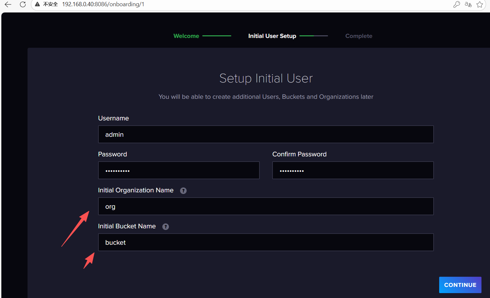
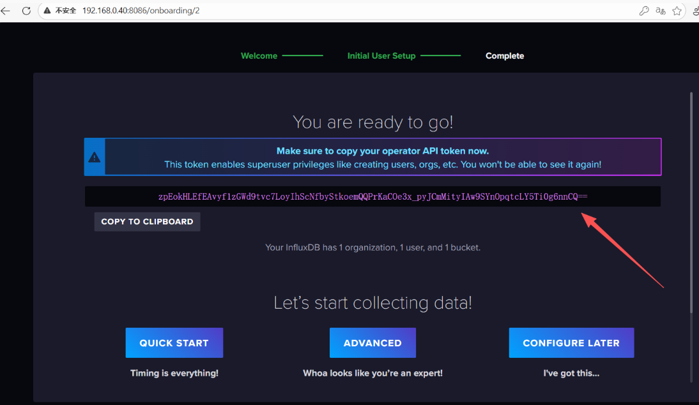

#### 5. 后端API

复制 `.env.file` 并修改配置后执行：

```bash
docker pull docker.1ms.run/zhitancorp/zhitan-api:latest
docker tag docker.1ms.run/zhitancorp/zhitan-api:latest zhitancorp/zhitan-api:latest

docker run -d -p 8080:8080 \
  --name zhitan-api \
  --restart=always \
  --env-file .env.file \
  zhitancorp/zhitan-api:latest
```

#### 6. Web管理平台

```bash
docker pull docker.1ms.run/zhitancorp/zhitan-web:latest
docker tag docker.1ms.run/zhitancorp/zhitan-web:latest zhitancorp/zhitan-web:latest

docker run -d \
  --name zhitan-web \
  -p 80:80 \
  -e API_BASE_URL=/prod-api \
  -e BACKEND_URL=http://你的IP:8080 \
  -e APP_TITLE=智碳能源管理系统 \
  -e APP_ENV=production \
  --restart=always \
  zhitancorp/zhitan-web:latest
```

</details>

### 访问系统

访问 Web 所在的 IP 与端口，使用测试账号登录：

```
账号：admin
密码：123456
```

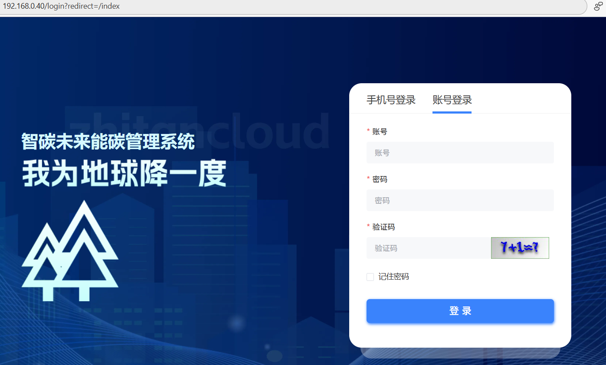

## 文档资源

| 文档 | 链接 | 说明 |
|------|------|------|
| GitHub Wiki | [zhitan-ems Wiki](https://github.com/zhitancloud/zhitan-ems/wiki) | 开发文档和用户手册 |
| Gitee Wiki | [zhitan-ems Wiki](https://gitee.com/liulingling1993/zhitan-ems/wikis/) | 同上（Gitee镜像） |
| API文档 | `http://localhost:8080/swagger-ui/index.html` | 本地部署后访问 |
| 更新计划 | [60天持续更新计划](docs/UPDATE_PLAN.md) | 单元测试 + 文档更新计划 |

## 开源协议

本项目采用 [AGPL](https://www.gnu.org/licenses/agpl-3.0.en.html) + [ZTPL](./LICENSE) 双协议：

- **个人学习 / 研究 / 教育** → 遵循 AGPL 协议，免费使用，修改成果需同样开源
- **商业闭源 / SaaS / 内部使用 / 专有集成** → 需获取 ZTPL 商业授权

> 学生和教师用于学习或教学，可联系我们获取免费培训与指导（远程）。  
> 商业授权请联系微信，备注：ems+姓名。

## 社区交流

我们非常欢迎您的参与和反馈！

### QQ群交流

技术学习与咨询请加入QQ群：**1037733518**（备注：ems+姓名）

<p align="center">
  
</p>

### 微信交流

商业授权、培训等事宜请加微信（备注：ems+姓名）

<p align="center">
  
</p>

## 参与贡献

我们热烈欢迎任何形式的贡献！

### 贡献流程

1. Fork 本仓库
2. 创建功能分支 (`git checkout -b feature/AmazingFeature`)
3. 提交更改 (`git commit -m 'Add some AmazingFeature'`)
4. 推送到分支 (`git push origin feature/AmazingFeature`)
5. 发起 Pull Request

### 开发规范

- 遵循项目现有的代码风格
- 添加适当的注释和文档
- 确保所有测试通过
- 提交前进行充分测试

### 报告问题

如果您发现任何问题，请在 Issues 中提交，并附上详细的描述和重现步骤。

---

<p align="center">
  <strong>© 2026 智碳未来  -  我为地球降1℃ </strong>
</p>
