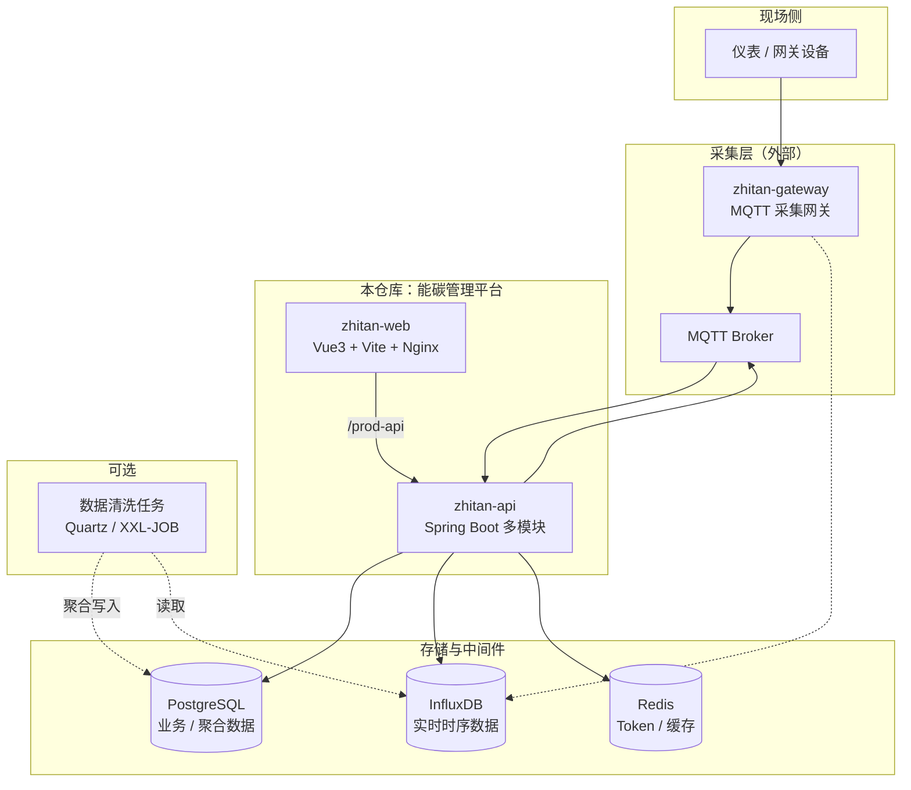
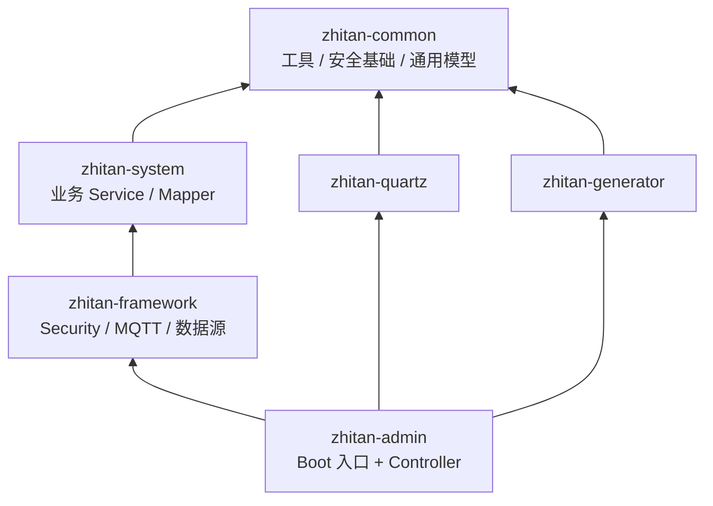
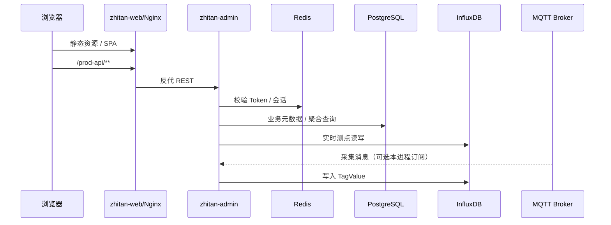

# 系统架构文档

> 本文档说明智碳能源管理系统（Zhitan EMS）的整体架构、多模块职责、依赖关系与核心数据流向，面向开发者与架构维护人员。

---

## 目录

- [一、架构总览](#一架构总览)
- [二、技术栈](#二技术栈)
- [三、仓库与目录结构](#三仓库与目录结构)
- [四、后端多模块职责](#四后端多模块职责)
- [五、模块依赖关系](#五模块依赖关系)
- [六、前端架构](#六前端架构)
- [七、数据流向](#七数据流向)
- [八、业务域划分](#八业务域划分)
- [九、安全与认证](#九安全与认证)
- [十、部署架构](#十部署架构)
- [十一、关键配置文件](#十一关键配置文件)
- [十二、相关文档](#十二相关文档)

---

## 一、架构总览

完整的能碳管理平台由 **三个核心组件** 构成（与 README 保持一致）：

| 组件 | 说明 | 本仓库是否包含 |
|------|------|----------------|
| 能碳平台管理端 | 后台管理界面 + REST API | **是**（本项目） |
| 数据采集网关 | MQTT 网关：现场设备 → Broker / 时序库 | 否，见 [zhitan-gateway](https://gitee.com/liulingling1993/zhitan-gateway) |
| 数据清洗服务 | 时序数据定期聚合写入关系库，供分析报表 | 否；可用 Quartz / XXL-JOB 等按业务自建 |

本仓库聚焦 **管理端**：Spring Boot 多模块后端 + Vue3 前端 SPA，对接 PostgreSQL（业务库）、InfluxDB（时序库）、Redis（缓存/会话）、MQTT Broker（采集接入）。



---

## 二、技术栈

### 后端

| 技术 | 版本 / 说明 |
|------|-------------|
| JDK | 1.8 |
| Spring Boot | 2.5.15 |
| Spring Framework | 5.3.33 |
| Web 容器 | Undertow（排除 Tomcat） |
| 安全 | Spring Security + JWT（jjwt 0.9.1） |
| ORM | MyBatis-Plus 3.5.6 |
| 连接池 / 多数据源 | Druid 1.2.20、dynamic-datasource 3.5.2 |
| 关系库 | PostgreSQL 14+ |
| 时序库 | InfluxDB 2.7+（`influxdb-client-java` 3.4.0） |
| 缓存 | Redis 6.x（Lettuce） |
| 消息 | Eclipse Paho MQTT（框架内 `MqttClientUtil`） |
| 定时任务 | Quartz（`zhitan-quartz` 模块） |
| API 文档 | Springfox Swagger 3.0.0 |
| JSON | Fastjson2 2.0.43 |
| 项目版本 | Maven 工程 `2.5.2`（产品对外版本见 README v3.0） |

### 前端

| 技术 | 版本 / 说明 |
|------|-------------|
| Vue | 3.3.9 |
| UI | Element Plus 2.4.3 |
| 构建 | Vite 5.0.4 |
| 状态 | Pinia 2.1.7 |
| 路由 | Vue Router 4.2.5 |
| 图表 | ECharts 5.4.3 |
| HTTP | Axios 0.27.2 |
| Node | ≥ 18（Docker 镜像 `node:18-alpine`） |

---

## 三、仓库与目录结构

```
zhitan-ems/
├── zhitan-api/                      # 后端 Maven 多模块工程
│   ├── zhitan-admin/                # 启动入口 + REST Controller
│   ├── zhitan-common/               # 公共工具、安全基础、通用模型
│   ├── zhitan-framework/            # Security / MQTT / 数据源 / AOP
│   ├── zhitan-system/               # 业务域（约 31 个包）
│   ├── zhitan-quartz/               # 定时任务
│   ├── zhitan-generator/            # 代码生成（开发辅助）
│   ├── Dockerfile
│   └── pom.xml
├── zhitan-web/                      # 前端 Vue3 SPA
│   ├── src/
│   ├── nginx.conf
│   ├── Dockerfile
│   └── docker-entrypoint.sh
├── zhitan-gateway/                  # MQTT 采集网关
├── sql/                             # 统一初始化脚本（如 public-v3.sql）
├── docker/                          # Compose 一键构建部署
├── docs/                            # 独立文档
├── images/                          # README 配图
├── README.md
└── .env.file                        # Docker / 环境变量模板
```

> 说明：部分历史文档仍写 `zhitan-vue` 或扁平的 `zhitan-admin/`。以当前仓库为准：**前端目录为 `zhitan-web/`，后端统一在 `zhitan-api/` 下，SQL 在根目录 `sql/`**。

---

## 四、后端多模块职责

### 1. `zhitan-admin`（应用入口）

- Spring Boot 启动类：`com.zhitan.AdminApplication`
- 承载全部 REST Controller（`com.zhitan.web.controller.*`）
- 打可运行 Fat JAR；持有 `application.yml`、logback、MyBatis 等运行配置
- 默认端口 **8080**，上下文路径 `/`
- 控制器保持轻薄，业务委托给 `zhitan-system` / 框架层服务

### 2. `zhitan-common`（公共基础）

- 注解、常量、枚举、异常、过滤器（XSS、防重复提交）
- 通用返回体（如 `AjaxResult`）、登录用户模型、工具类
- Redis、JWT 辅助、Spring Security / MyBatis-Plus / PageHelper / POI 等基础依赖
- **不包含**业务 Controller 与领域服务实现

### 3. `zhitan-framework`（基础设施）

- Security 配置（无状态 JWT）、`TokenService`、登录 / 短信 / SSO 相关能力
- `JwtAuthenticationTokenFilter`、Druid / 动态数据源、AOP、拦截器
- MQTT 客户端与消息回调（可写入 Influx）
- 全局异常处理、短信等外部集成
- 依赖 `zhitan-system`，以便 MQTT / 实时链路调用仓储与业务服务

### 4. `zhitan-system`（业务核心）

- 约 31 个业务包：领域模型、Mapper、Service
- PostgreSQL：元数据、权限、告警、配置、能耗聚合表等
- InfluxDB：实时测点读写（如 `InfluxDBRepository`）
- **不直接暴露** HTTP；由 `zhitan-admin` 的 Controller 调用

### 5. `zhitan-quartz`（调度）

- 若依风格定时任务：`SysJob` / `SysJobLog`、Cron 工具、任务调用
- 可用于运维类调度；业务侧「数据清洗」也可挂载于此（需自行实现）

### 6. `zhitan-generator`（代码生成）

- 基于 Velocity 的表结构代码生成（开发期工具）
- 仅依赖 `zhitan-common`

---

## 五、模块依赖关系

依赖方向：**下层不依赖上层**；业务代码落在 `system`，框架与入口向上组装。



| 模块 | 直接依赖 |
|------|----------|
| `zhitan-system` | `zhitan-common` |
| `zhitan-framework` | `zhitan-system`（间接含 common） |
| `zhitan-quartz` | `zhitan-common` |
| `zhitan-generator` | `zhitan-common` |
| `zhitan-admin` | `zhitan-framework`、`zhitan-quartz`、`zhitan-generator` |

---

## 六、前端架构

```
zhitan-web/
├── src/
│   ├── api/              # 按业务拆分的接口封装
│   ├── assets/           # 静态资源
│   ├── components/       # 通用组件
│   ├── layout/           # 布局与导航
│   ├── router/           # 路由表
│   ├── store/            # Pinia
│   ├── utils/            # request / auth / env 等
│   ├── views/            # 业务页面（看板、监测、分析、系统管理等）
│   ├── permission.js     # 路由守卫
│   └── main.js
├── vite.config.js        # 开发代理：/dev-api → 后端
├── nginx.conf            # 生产：静态资源 + /prod-api 反代
└── docker-entrypoint.sh  # 运行时写入 config.js、替换 BACKEND_URL
```

### 请求约定

| 环境 | API 前缀 | 说明 |
|------|----------|------|
| 开发 | `/dev-api` | Vite 代理到后端 |
| 生产 | `/prod-api` | Nginx `proxy_pass` 到 API |
| 预发 | `/stage-api` | `.env.staging` |

- Axios 统一在请求头携带：`Authorization: Bearer <token>`
- Token 默认存于 `localStorage`（键名如 `Admin-Token`）
- Docker 部署可通过 `window.APP_CONFIG` 在运行时注入后端地址，无需重新打包

---

## 七、数据流向

### 1. 实时采集写入

本仓库内建 **MQTT 订阅 → 解析 → Influx 写入** 路径（同时推荐使用独立网关作为主采集通道）：

```text
现场设备 / 网关
    → MQTT Broker（MQTT_HOST 等配置）
    → MqttClientUtil 订阅
    → MqttMessageCallback 解析报文（如 values 测点列表）
    → 映射仪表测点编码 TagValue.tagCode
    → InfluxDBRepository.store(...)
    → InfluxDB 2.x（org / bucket / token，见 rtdb.*）
```

### 2. 实时查询（前端 / API）

```text
浏览器 → /prod-api|/dev-api → Spring API
    → 实时相关接口（如 RTDB 查询）
    → RealtimeDatabase / InfluxDBRepository.query*
    → 结合 PostgreSQL 中的仪表测点元数据组装返回
```

### 3. 业务与历史分析

| 存储 | 典型数据 |
|------|----------|
| PostgreSQL | 用户权限、菜单、仪表档案、模型配置、告警、能耗聚合表（如 `energy_used` 等） |
| InfluxDB | 高频实时测点、历史趋势原始/细粒度序列 |
| Redis | JWT 会话（`LoginUser`）、验证码、限流与通用缓存 |

分析类功能（综合指标、尖峰平谷、重点设备、同环比等）主要消费 **PostgreSQL 聚合结果**；聚合可由外部清洗任务或自建 Job 从 Influx 写入。

### 4. 端到端示意



---

## 八、业务域划分

`zhitan-system` 下主要包及其职责：

| 包名 | 职责简述 |
|------|----------|
| `home` | 首页看板数据聚合 |
| `realtimedata` | 实时库访问、趋势与时段数据 |
| `alarm` | 告警项、阈值、历史与分析 |
| `comprehensivestatistics` | 日/月/年综合指标统计 |
| `keyequipment` | 重点设备能耗分析 |
| `processenergy` | 工序能耗分析 |
| `peakvalley` / `spikesandvalleys` | 尖峰平谷统计与方案配置 |
| `consumptionanalysis` | 能耗同环比对比 |
| `branchanalysis` | 支路能耗分析 |
| `Itemizedenergyanalysis` | 分项能耗分析 |
| `costmanagement` | 电价策略、成本与偏差 |
| `carbonemission` | 碳排放计算 |
| `saving` | 节能项目与策略 |
| `benchmarkmanage` | 能耗基准 / 对标 |
| `energyUsed` | 能耗聚合表查询 |
| `energydata` / `energyMonitor` / `energyIndicators` / `statisticalAnalysis` | 能耗统计、质量监测、指标与综合分析 |
| `meter` | 仪表 / 设备档案 |
| `model` | 计算模型、节点、测点、公式 |
| `gatewaysetting` | 网关配置与状态 |
| `basicdata` / `basicSetup` | 能源类型模板、组态 SVG 等基础配置 |
| `productoutput` | 产品产量（支撑单耗） |
| `powerDistribution` | 配用电相关 |
| `knowledgeBase` | 知识库 |
| `history` | 历史数据相关模型 |
| `singlelogin` | 单点登录辅助 |
| `system` | 用户 / 角色 / 菜单 / 部门 / 字典 / 日志 / 参数（系统管理） |

Controller 层按业务在 `zhitan-admin` 中组织，与上表域一一对应调用。

---

## 九、安全与认证

```text
POST /login（或短信登录 / SSO）
    → 认证服务校验账号
    → TokenService 签发 JWT，会话写入 Redis
    → 前端存储 Token

后续请求
    → Authorization: Bearer <token>
    → JwtAuthenticationTokenFilter
    → 从 Redis 加载 LoginUser
    → 权限注解 / 菜单路由控制
```

常见匿名放行（以 `SecurityConfig` 为准）：`/login`、`/register`、`/captchaImage`、短信与 SSO 相关路径、Swagger、Druid 监控等。

| 项 | 说明 |
|----|------|
| Token 请求头 | `Authorization` |
| 默认有效期 | 可通过 `TOKEN_EXPIRE_TIME` 配置（yml 中常见为分钟级，如 300） |
| 会话存储 | Redis（非仅本地 JWT 无状态纯校验） |
| 说明 | 配置中若残留 `shiro.session` 等历史项，**实际以 Spring Security + JWT 为准** |

---

## 十、部署架构

```text
[浏览器 :80]
    → zhitan-web（nginx:1.25）
         ├─ 静态 SPA
         └─ /prod-api/  →  BACKEND_URL（zhitan-api :8080）
              → PostgreSQL :5432
              → Redis :6379
              → InfluxDB :8086
              → MQTT Broker :1883
```

| 产物 | 路径 | 说明 |
|------|------|------|
| API 镜像 | `zhitan-api/Dockerfile` | Maven 构建 → Temurin 8 运行 `zhitan-admin` JAR |
| Web 镜像 | `zhitan-web/Dockerfile` | Node 18 构建 → nginx alpine |
| 环境模板 | `.env.file` | DB / Redis / RTDB / MQTT / Token / SSO / SMS 等 |
| 初始化 SQL | `sql/public-v3.sql` | PostgreSQL 初始化 |

推荐启动顺序：PostgreSQL → Redis → MQTT → InfluxDB → API（加载 `.env.file`）→ Web（配置 `API_BASE_URL` / `BACKEND_URL`）。

详细步骤见：[源码部署文档](./source-deployment.md)、[前端部署文档](./frontend-deployment.md)。

---

## 十一、关键配置文件

| 文件 | 用途 |
|------|------|
| `zhitan-api/zhitan-admin/src/main/resources/application.yml` | 后端主配置（数据源、Redis、Token、rtdb、mqtt、Swagger、XSS、短信、SSO 等） |
| `.env.file` | Docker / 运维环境变量模板 |
| `zhitan-web/.env.development` | 开发：`VITE_APP_BASE_API=/dev-api` |
| `zhitan-web/.env.production` | 生产：`VITE_APP_BASE_API=/prod-api` |
| `zhitan-web/vite.config.js` | 开发服务器与代理 |
| `zhitan-web/nginx.conf` | 生产静态资源与 `/prod-api` 反代 |
| `zhitan-web/src/utils/request.js` | Axios 与 Bearer 注入 |
| `zhitan-web/src/utils/env.js` | 运行时 `APP_CONFIG` 合并 |
| `zhitan-web/src/permission.js` | 前端路由鉴权 |
| `zhitan-api/pom.xml` | 版本与模块清单 |
| `zhitan-api/zhitan-framework/.../config/SecurityConfig.java` | 安全规则 |
| `zhitan-api/zhitan-framework/.../mqtt/` | MQTT 接入 |
| `zhitan-api/zhitan-system/.../influxdb/InfluxDBRepository.java` | Influx 读写 |

---

## 十二、相关文档

| 文档 | 说明 |
|------|------|
| [快速开始指南](./快速开始指南文档.md) | 5 分钟上手（若仓库中存在该文件） |
| [源码部署文档](./source-deployment.md) | 非 Docker 全量部署 |
| [前端部署文档](./frontend-deployment.md) | Vue 构建与 Nginx |
| [环境配置说明](./env-configuration.md) | `.env.file` 与前后端环境变量 |
| [数据库设计文档](./database-design.md) | 核心表结构 |
| [持续更新计划](./UPDATE_PLAN.md) | 测试与文档迭代计划 |
| 根目录 [README.md](../README.md) | 产品介绍、演示与 Docker 说明 |

---

*文档对应计划 Day 10；内容依据当前仓库 `zhitan-api` / `zhitan-web` 源码与配置整理。*
